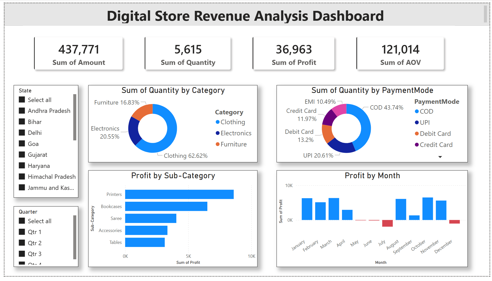

# Digital Store Revenue Analysis Dashboard

## 📌 Project Overview
The Digital Store Revenue Analysis Dashboard is an interactive Business Intelligence project developed using Microsoft Power BI. The dashboard converts raw retail transaction data into meaningful business insights that help analyze sales performance, profitability, customer behavior, and regional trends.

This project was created to demonstrate practical skills in data analysis, dashboard design, data modeling, and business reporting using Power BI.

---

## 🖼️ Dashboard Preview

---

## 🖥️ Dashboard Overview
The dashboard provides a centralized view of key business metrics and performance indicators through interactive visualizations.

Users can:
- Monitor total revenue, profit, quantity sold, and average order value
- Analyze category-wise sales distribution
- Compare customer payment preferences
- Identify high-profit product sub-categories
- Track monthly profit trends
- Filter reports dynamically using State and Quarter slicers

All charts and visuals are interconnected, allowing users to explore insights interactively.

---

## 📊 Key Performance Indicators (KPIs)
The dashboard includes the following business metrics:

- **Total Revenue** – Overall sales generated
- **Total Quantity Sold** – Number of units sold
- **Total Profit** – Net profit earned
- **Average Order Value (AOV)** – Average customer spending per order

---

## 📈 Dashboard Insights
### Product Category Analysis
Visualizes the contribution of different product categories such as Clothing, Electronics, and Furniture.

### Payment Mode Analysis
Analyzes customer payment preferences including COD, UPI, Debit Card, Credit Card, and EMI.

### Profit by Sub-Category
Highlights the most profitable product sub-categories.

### Monthly Profit Trends
Shows month-wise profit fluctuations to identify seasonal business patterns.

### Regional Analysis
Allows users to filter and analyze performance across different states and quarters.

---

## 📌 Business Problem
Retail businesses generate large amounts of transactional data every day. Without proper visualization and analysis, it becomes difficult to identify trends, monitor profitability, and make informed business decisions.

This dashboard helps simplify complex sales data into an easy-to-understand and interactive reporting system.

---

## 🎯 Objectives
- Build an interactive Power BI dashboard for sales analysis
- Track revenue and profit performance
- Analyze customer payment behavior
- Identify profitable products and categories
- Enable dynamic filtering and business reporting
- Transform raw data into actionable insights

---

## 🛠️ Tools & Technologies Used
- Microsoft Power BI
- Power Query Editor
- DAX (Data Analysis Expressions)
- Data Modeling
- Interactive Slicers & Filters

---

## 📂 Dataset Description
The dataset contains simulated retail transaction data including:
- Sales Amount
- Profit
- Quantity Sold
- Product Categories
- Payment Modes
- State Information
- Monthly Transactions

The dataset was used for learning and portfolio purposes only.

---

## 📚 Key Learnings
- Developed interactive dashboards using Power BI
- Learned data cleaning and transformation using Power Query
- Improved understanding of KPI creation and DAX calculations
- Gained experience in business data visualization
- Learned how to present analytical insights professionally

---

## 🚀 Conclusion
This project demonstrates how Power BI can be used to transform raw retail data into meaningful business insights through interactive dashboards and visual analytics.

The dashboard helps users monitor business performance, identify trends, and support data-driven decision-making efficiently.